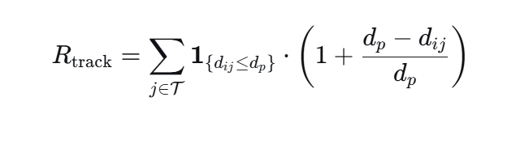
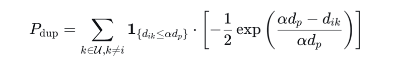
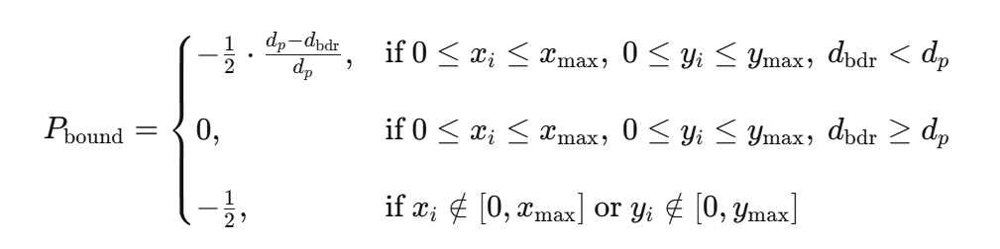
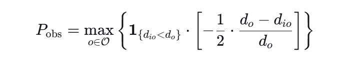

# 奖励函数

#### 多目标追踪奖励



当无人机感知范围内含有每个目标，都会贡献一个正向奖励，目标在感知边界时reward为1，完全重合时为最大值2

#### 重复追踪惩罚



当另一架无人机与本机的距离<=2*dp时，施加指数级别的负向惩罚（-0.5e，-0.5）

#### 边界惩罚



三种情况：未越界且距离边界大于感知范围，惩罚为0

未越界但距离边界小于感知范围 施加最大值为-0.5的线性惩罚

已经越界，直接进行-0.5的惩罚

#### 障碍物惩罚



当无人机与障碍物距离小于碰撞区域时进行线性的惩罚，最大值为-0.5

所有的奖励函数都需要进行进一步的归一化与裁剪进行使用

### 伪代码（MAAC-R）

```python
初始化：
    环境 env (N 架无人机, M 目标, K 障碍物)
    策略网络 Actor (局部状态 → 动作概率)
    价值网络 Critic (全局状态 → Q值/价值)
    经验回放缓冲区 buffer
    优化器 optimizer_actor, optimizer_critic

for 每一轮训练 episode = 1 to max_episodes:
    环境重置 env.reset()
    收集经验

    for 每一步 step = 1 to max_steps:
        每个无人机 i 观测局部状态 s_i
        每个无人机 i 通过 Actor 选取动作 a_i ~ π(a_i | s_i)
        执行所有动作 a_1 ... a_N
        环境返回 奖励 r, 全局状态 s', 覆盖目标数, 碰撞数
        将 (s_i, a_i, r, s'_i) 存入 buffer

    ---------------- 开始网络更新 ----------------
    重复 K 次:
        从 buffer 采样一批经验 B

        ---------------- 更新 Critic ----------------
        用 Critic 预测当前 Q(s, a)
        计算目标 Q_target = r + γ * Critic(s', a')
        Critic 损失 = MSE(Q, Q_target)
        反向传播更新 Critic

        ---------------- 更新 Actor -----------------
        Actor 损失 = - Critic(s, a).mean()  # 让评分更高
        反向传播更新 Actor

    保存模型、绘制曲线、生成动画

最终输出：训练好的 Actor 网络
===========================================================
```


### 伪代码（MAPPO）

```python
初始化：
    环境 env (N 架无人机, M 目标, K 障碍)
    共享策略网络 Actor (局部观测 → 动作概率)
    全局价值网络 Critic (所有无人机状态 → 状态价值 V)
    旧策略网络 Actor_old (参数同步于 Actor)
    经验缓冲区 buffer
    优化器 opt_actor, opt_critic

for 每一轮训练 episode = 1 to max_episodes:
    环境重置 env.reset()
    清空轨迹列表 trajectories

    # ==================== 收集经验（多机并行）====================
    for 每一步 step = 1 to max_steps:
        对每架无人机 i:
            观测局部状态 s_i
            通过 Actor 采样动作 a_i ~ π(a_i | s_i)
            记录 log 概率 log_p_old = Actor_old.log_prob(a_i)
        
        执行所有动作 a_1...a_N
        环境返回 全局奖励 r, 新状态 s', 覆盖数、碰撞数
        
        存储轨迹：(s_i, a_i, r, log_p_old, s'_i)

    # ==================== 计算优势函数 GAE =====================
    对整条轨迹:
        用 Critic 计算 V(s)
        计算 GAE 优势函数 A
        计算回报值 Returns = V(s) + A

    # ==================== PPO 多次更新 =====================
    重复 K 次（如 10 次）:
        从轨迹中随机采样一批数据
        
        # 1. 更新 Critic
        预测 V_pred = Critic(s)
        Critic 损失 = MSE(V_pred, Returns)
        反向传播更新 Critic

        # 2. 更新 Actor（PPO 裁剪策略）
        新策略 log_p_new = Actor.log_prob(a)
        重要性权重 ratio = exp(log_p_new - log_p_old)
        Actor 损失 = - min( ratio * A, clip(ratio, 0.8, 1.2) * A )
        反向传播更新 Actor

    # ==================== 同步旧网络 =====================
    Actor_old.load_state_dict(Actor.state_dict())

    保存模型、绘制奖励曲线、生成动画视频

输出：训练完成的 Actor 网络（无人机决策模型）
===========================================================
```

修改位置
增加课程训练 随着训练的轮次逐渐增加课程的难度，在一开始降低追踪的难度，让无人机学会追踪

之后增加了持续追踪奖励和视野中心奖励

障碍物惩罚的函数也可以进行优化 可以使用指数函数，在距离特别近时施加较大的惩罚
同时重复追踪的惩罚应该更贴近现实 <2dp就施加惩罚不合理